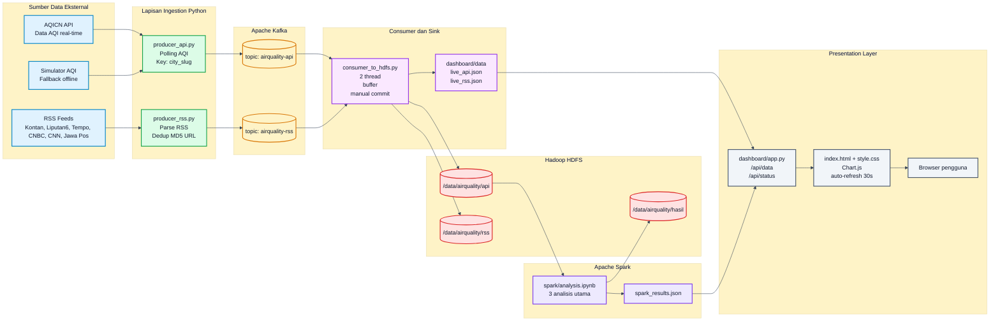
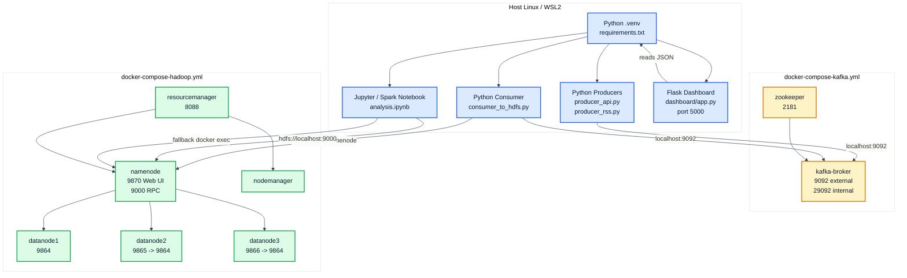
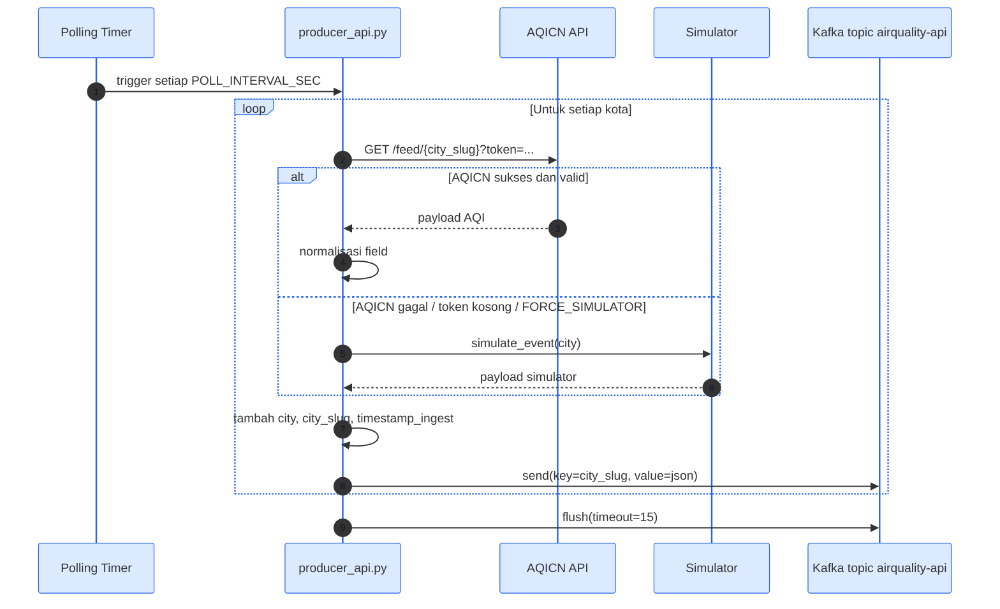
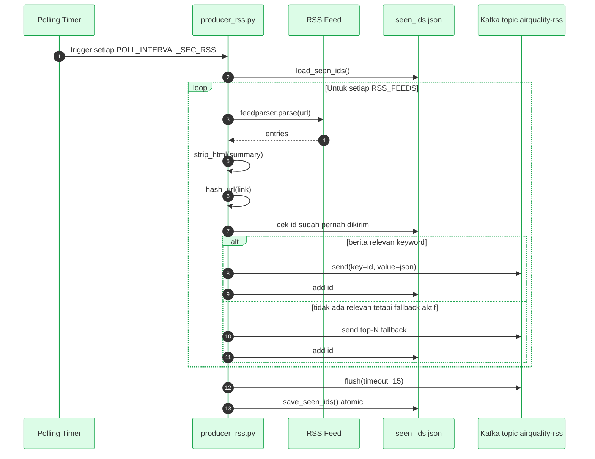
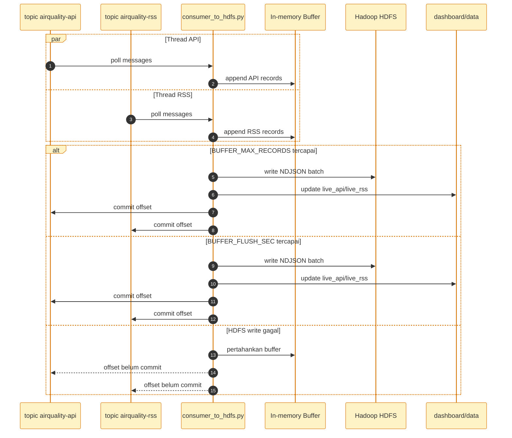
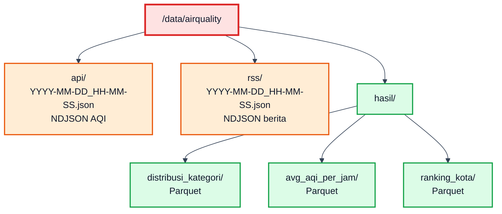
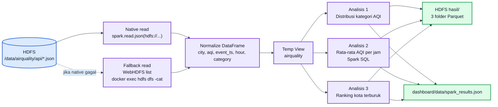
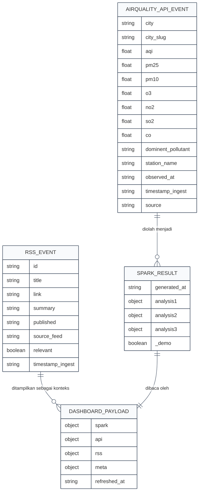
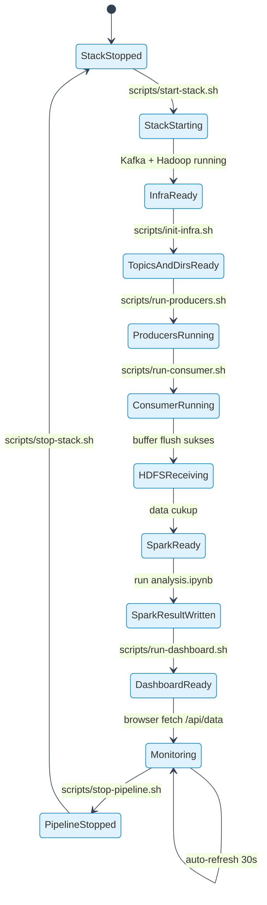
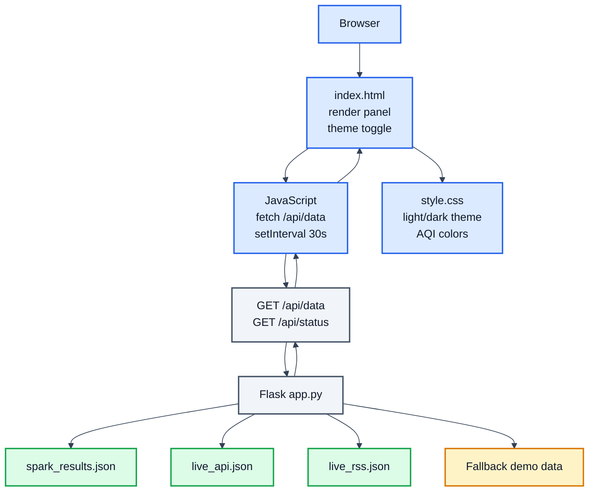

<!-- markdownlint-disable MD012 MD033 -->

# AirQuality Alert - Dokumen Arsitektur A1

Dokumen ini adalah file khusus untuk menjelaskan arsitektur proyek dalam bentuk poster teknis berukuran **A1 landscape**. Fokus dokumen ini adalah diagram besar, berwarna, dan mudah dipakai untuk presentasi atau export ke PDF.

> **Target format**
> Ukuran kertas: A1 landscape.
> Rasio visual: lebar, multi-kolom, cocok untuk poster arsitektur.
> Diagram: Mermaid berwarna, dengan teks penjelas singkat di bawah setiap diagram.
> Catatan: Mermaid dirender otomatis di GitHub dan banyak Markdown preview modern. Untuk hasil poster terbaik, buka di Markdown preview yang mendukung Mermaid lalu export/print ke PDF ukuran A1 landscape.

<style>
@page {
  size: A1 landscape;
  margin: 18mm;
}

body {
  font-family: Inter, ui-sans-serif, system-ui, -apple-system, BlinkMacSystemFont, "Segoe UI", Arial, sans-serif;
  color: #0f172a;
  background: #ffffff;
  line-height: 1.45;
}

h1 {
  font-size: 42px;
  letter-spacing: -0.04em;
  margin-bottom: 8px;
}

h2 {
  font-size: 28px;
  margin-top: 34px;
  padding-bottom: 8px;
  border-bottom: 3px solid #1e3a8a;
}

h3 {
  font-size: 20px;
  margin-top: 24px;
}

p,
li,
td,
th {
  font-size: 15px;
}

blockquote {
  border-left: 6px solid #2563eb;
  background: #eff6ff;
  padding: 12px 16px;
  margin: 18px 0;
}

table {
  width: 100%;
  border-collapse: collapse;
  margin: 12px 0 24px;
}

th {
  background: #1e3a8a;
  color: #ffffff;
}

th,
td {
  border: 1px solid #cbd5e1;
  padding: 8px 10px;
  vertical-align: top;
}

.a1-grid {
  display: grid;
  grid-template-columns: 1fr 1fr;
  gap: 18px;
}

.caption {
  font-size: 14px;
  color: #334155;
  background: #f8fafc;
  border: 1px solid #cbd5e1;
  padding: 10px 12px;
  margin-top: 8px;
}

.page-break {
  page-break-before: always;
}
</style>

---

## 1. Peta Besar Sistem



<div class="caption">
Diagram ini menunjukkan arsitektur end-to-end. Data masuk dari AQICN/simulator dan RSS, melewati Kafka, ditulis ke HDFS, dianalisis Spark, lalu ditampilkan lewat dashboard Flask. Warna menunjukkan batas tanggung jawab tiap lapisan.
</div>

---

## 2. Topologi Deployment Lokal



<div class="caption">
Deployment lokal memisahkan proses Python di host dan service besar di Docker. Producer dan consumer mengakses Kafka melalui `localhost:9092`; consumer dan notebook memakai strategi `docker exec` bila akses HDFS langsung dari WSL2 bermasalah.
</div>

---

## 3. Sequence Diagram Ingestion AQI



<div class="caption">
Producer API selalu berusaha memakai data asli AQICN. Jika token kosong atau request gagal, simulator mengisi data agar pipeline tetap bisa diuji dan dashboard tetap bisa berjalan saat demo.
</div>

---

## 4. Sequence Diagram Ingestion RSS



<div class="caption">
Producer RSS menjaga agar berita yang sama tidak dikirim berulang. Filter keyword membuat berita yang tampil lebih dekat ke tema lingkungan, sementara fallback Top-N menjaga dashboard tidak kosong saat feed sedang tidak memuat kata kunci.
</div>

---

## 5. Sequence Diagram Consumer ke HDFS



<div class="caption">
Offset Kafka baru di-commit setelah data berhasil ditulis ke HDFS dan mirror dashboard diperbarui. Ini menjaga agar data tidak dianggap selesai sebelum benar-benar tersimpan.
</div>

---

## 6. Struktur Penyimpanan HDFS



<div class="caption">
Folder `api` dan `rss` menyimpan data mentah hasil consumer. Folder `hasil` menyimpan output Spark dalam format Parquet. Pemisahan ini menjaga batas antara raw data dan processed data.
</div>

---

## 7. Arsitektur Spark Analysis



<div class="caption">
Spark membaca data historis dari HDFS. Jika akses native HDFS bermasalah di WSL2, notebook memakai fallback yang tetap mengambil data dari HDFS, hanya jalur pembacaannya yang berbeda.
</div>

---

## 8. Data Contract API dan RSS



<div class="caption">
Kontrak data menjaga agar producer, consumer, Spark, dan dashboard punya ekspektasi field yang sama. Field utama untuk analisis adalah kota, AQI, waktu, kategori, dan hasil agregasi.
</div>

---

## 9. State Machine Pipeline Runtime



<div class="caption">
State machine ini berguna untuk menjelaskan urutan demo. Infrastruktur harus siap lebih dulu, kemudian topic dan folder dibuat, producer-consumer berjalan, Spark membuat hasil, lalu dashboard menampilkan data.
</div>

---

## 10. Arsitektur Dashboard



<div class="caption">
Dashboard tidak membaca HDFS langsung. Flask membaca JSON lokal yang sudah diringkas oleh consumer dan Spark. Jika file belum ada, data demo dipakai agar dashboard tetap bisa dibuka.
</div>

---

## 11. Matriks Komponen

| Lapisan | File / Service | Input | Output | Alasan Desain |
| --- | --- | --- | --- | --- |
| AQI Producer | `kafka/producer_api.py` | AQICN / simulator | Kafka `airquality-api` | Memisahkan pengambilan AQI dari penyimpanan. |
| RSS Producer | `kafka/producer_rss.py` | RSS feeds | Kafka `airquality-rss` | Menambahkan konteks berita. |
| Broker | `kafka-broker` | Event JSON | Topic log | Menstabilkan laju data. |
| Consumer | `kafka/consumer_to_hdfs.py` | Kafka topics | HDFS + mirror JSON | Menulis batch dan menjaga offset. |
| Storage | HDFS | NDJSON | Data historis | Menyimpan arsip untuk Spark. |
| Analytics | `spark/analysis.ipynb` | HDFS API data | Parquet + JSON summary | Menghasilkan insight. |
| Backend | `dashboard/app.py` | JSON lokal | `/api/data` | Menyajikan data untuk frontend. |
| Frontend | `index.html`, `style.css` | `/api/data` | Dashboard visual | Memudahkan pembacaan hasil. |

---

## 12. Catatan Export A1

Untuk menjadikan dokumen ini poster A1:

1. Buka file `ARCHITECTURE_A1.md` pada Markdown preview yang mendukung Mermaid.
2. Pastikan diagram Mermaid berhasil dirender.
3. Gunakan print/export PDF.
4. Pilih ukuran kertas **A1**.
5. Pilih orientasi **Landscape**.
6. Jika preview mengabaikan CSS `@page`, atur ukuran A1 secara manual pada dialog print.

Alternatif CLI:

```bash
# Jika memakai mermaid-cli untuk render diagram satu per satu:
npx @mermaid-js/mermaid-cli -i ARCHITECTURE_A1.md -o architecture-output.svg
```

Catatan: rendering Markdown penuh dengan banyak diagram lebih stabil dilakukan dari preview editor yang mendukung Mermaid, lalu export ke PDF.
