# Narasi proyek AirQuality Alert (sangat mudah dipahami)

Ini versi cerita proyek untuk orang yang **tidak harus paham IT**. Detail teknis dan perintah ada di `README.md`.

**Isi file ini:** kamus → tujuan proyek → **banyak diagram Mermaid** (dari gambar besar sampai detail operasional). Baca urut, atau lompat ke [Peta diagram lengkap](#peta-diagram-lengkap).

---

## Kamus singkat (baca ini dulu)

Istilah di bawah ini sering muncul di penjelasan proyek. **Baca sekali**, nanti tidak terasa “tiba-tiba” muncul kata asing.

| Istilah | Arti sederhana |
| --- | --- |
| **Kualitas udara / indeks** | Angka yang mewakili seberapa “bersih” atau “kotor” udaranya. Di proyek ini dipanggil juga **AQI** (*Air Quality Index*): semacam nilai rapor untuk udara. |
| **Sumber angka di internet** | Layanan **AQICN** memberi angka kualitas udara lewat internet. Kalau tidak pakai token, tim bisa pakai **simulator**: angka buatan supaya sistem tetap bisa diuji. |
| **RSS** | Cara sebuah **situs berita** menyediakan **daftar berita terbaru** dalam format mesin. Komputer ambil daftar itu seperti **langganan podcast**, tapi untuk berita. |
| **Zookeeper** | Program pendukung yang membantu **Kafka** berkoordinasi di dalam klaster. Di Docker Anda tidak perlu menyentuhnya manual; cukup tahu ia “teman Kafka”. |
| **Antrian pesan (Kafka)** | **Kafka** seperti **lorong antrian**: siapa saja bisa **menaruh pesan** di belakang, program lain **mengambil dari depan**. Nama saluran disebut **topik**. |
| **Topik** | “Lorong” bernama di Kafka. Di proyek ini ada **`airquality-api`** (angka) dan **`airquality-rss`** (berita). |
| **Kunci pesan (message key)** | **Label** pada pesan di antrian. Untuk angka, kuncinya **nama kota**. Untuk berita, kuncinya **sidik digital dari link** (MD5) supaya satu berita punya identitas tetap. |
| **Grup konsumen (consumer group)** | Nama tim penerima. **API** dan **RSS** pakai **grup berbeda** supaya jarak baca antrian tidak saling ganggu. Di kode: `airquality-consumer-api` dan `airquality-consumer-rss`. |
| **Pengirim (Producer)** | Program yang **mengambil data dari luar**, lalu **memasukkan ke Kafka**. |
| **Penerima (Consumer)** | Program yang **mengambil dari Kafka**, lalu **menyimpan** ke gudang dan file lokal. |
| **Hadoop** | Keluarga perangkat lunak untuk data besar. |
| **HDFS** | **Gudang file** Hadoop (*Hadoop Distributed File System*): file bisa besar dan **disalin ke beberapa mesin**. |
| **NameNode / DataNode** | **NameNode** = buku catatan “file apa di mana”. **DataNode** = rak penyimpanan sebenarnya (di tugas ini ada tiga rak demo). |
| **YARN** | Bagian Hadoop mengatur **sumber daya** pekerjaan (ResourceManager + NodeManager). Ikut jalan di Docker agar mirip klaster sungguhan. |
| **NDJSON** | **Satu baris = satu JSON** (banyak catatan bertumpuk vertikal). Mudah dibaca mesin per baris. |
| **Spark** | Alat **hitung massal** atas banyak file. Di tim ini lewat notebook **`spark/analysis.ipynb`**. |
| **Flask** | Kerangka **situs kecil** dan **API** (meja layanan data untuk halaman web). |
| **Docker** | **Kotak** berisi Hadoop, Kafka, Zookeeper jalan seragam di laptop tiap anggota. |
| **API (web)** | **Alamat** yang dipanggil browser untuk **minta data** (misalnya `/api/data`). |

---

## Proyek ini untuk apa?

Tim kuliah membangun **AirQuality Alert**: memantau **kualitas udara** beberapa kota di **Jawa Timur**, menampilkan **berita** sebagai konteks, berujung **satu halaman web**.

**Latar belakang singkat:** udara berubah sepanjang hari; tiap kota beda; angka saja kurang tanpa berita; **riwayat** membantu lihat pola; **dashboard** memudahkan baca hasil.

---

## Mau menjawab pertanyaan apa?

| Pertanyaan awam | Yang dicari sistem |
| --- | --- |
| Jam berapa udara cenderung paling buruk? | Rata-rata per kota **per jam** |
| Kota mana paling bermasalah? | **Peringkat** kota |
| Seberapa sering tidak sehat? | **Distribusi kategori** (baik / sedang / tidak sehat / berbahaya) |
| Konteks berita? | Item dari **RSS** yang lolos filter kata kunci |

---

## Peta diagram lengkap

Di bawah ini **diagram per diagram**. Tiap diagram menambah detail; yang belakang paling “mikro”.

### 1. Satu garis besar: dari dunia luar sampai mata

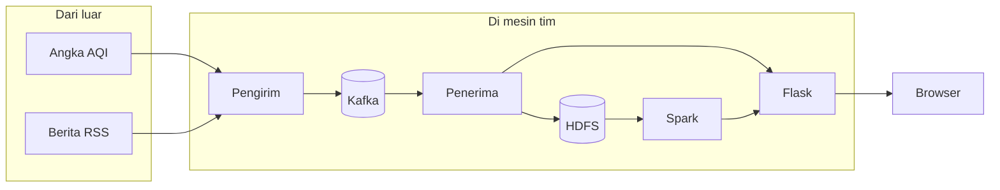

---

### 2. Dua “kotak Docker” yang harus hidup

Sistem penyimpanan antrian **terpisah** dari sistem gudang Hadoop; keduanya dihidupkan lewat Compose.

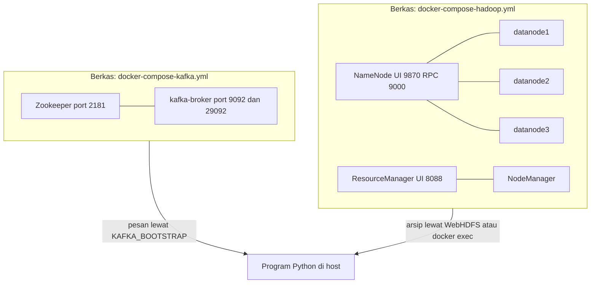

---

### 3. Setelah container aktif: skrip init membuat “rak” di Kafka dan HDFS

Skrip `scripts/init-infra.sh` **membuat dua topik** kalau belum ada, dan **folder HDFS** untuk tiga jenis isi.

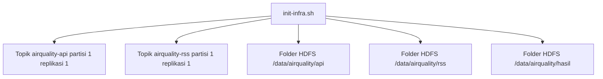

Catatan README: **topik tidak dibuat otomatis** oleh broker (`KAFKA_AUTO_CREATE_TOPICS_ENABLE=false`) sehingga **harus** lewat inisialisasi seperti ini.

---

### 4. Alur isi antrian: dua sumber → dua jenis pengirim → Kafka

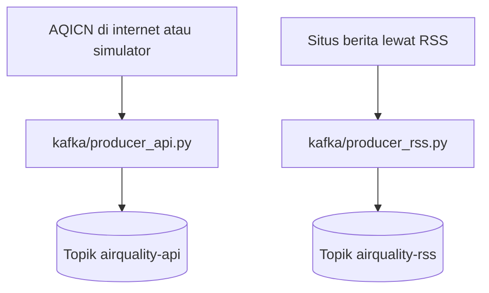

---

### 5. Isi perut pengirim angka (producer API)

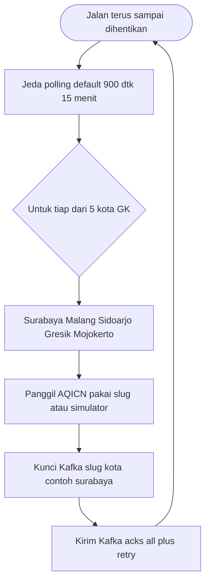

Token `AQICN_TOKEN` dan `FORCE_SIMULATOR` mengatur pakai sumber sungguhan atau simulator (`README.md` / `.env`).

---

### 6. Isi perut pengirim berita (producer RSS)

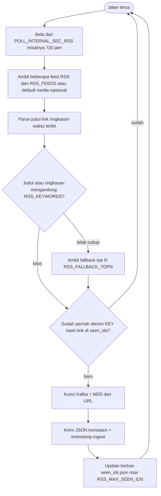

---

### 7. Kafka: topik, kunci, dan grup konsumen (ringkas)

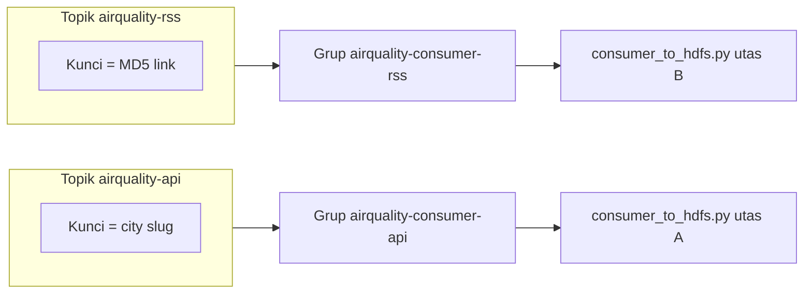

---

### 8. Penerima: dua utas, buffer, flush ke HDFS + cermin dashboard

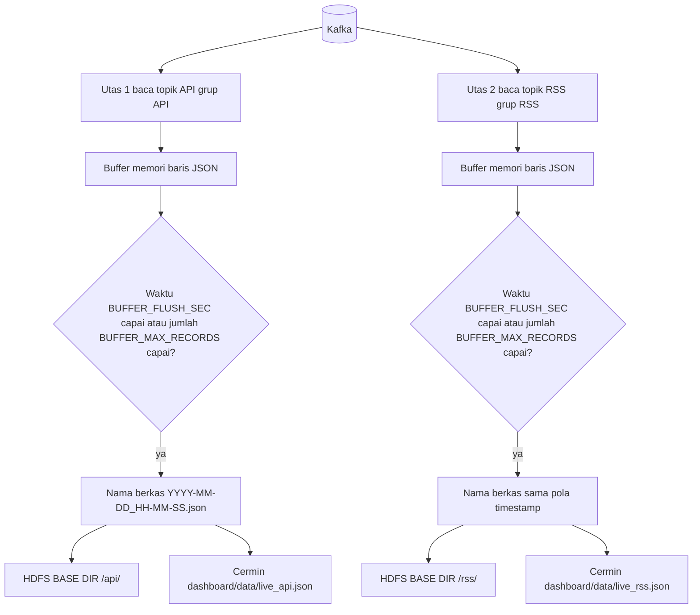

Default dari kode: `BUFFER_FLUSH_SEC` 180 detik (3 menit), `BUFFER_MAX_RECORDS` 200, `auto_offset_reset=earliest`. Tulis HDFS default **`docker exec` ke kontainer namenode** agar aman di WSL2 (README menjabarkan `HDFS_WRITE_MODE`).

---

### 9. Peta folder HDFS dan salinan lokal dashboard

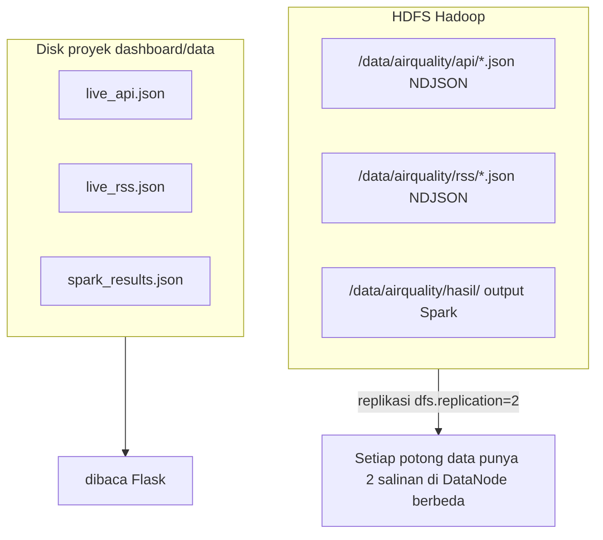

---

### 10. Rangka Hadoop penyimpanan (siapa menyimpan apa)

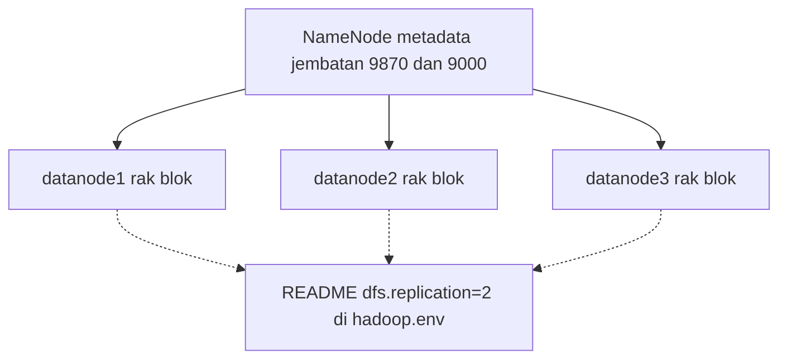

---

### 11. Spark: dari arsip hingga tiga jawaban bisnis

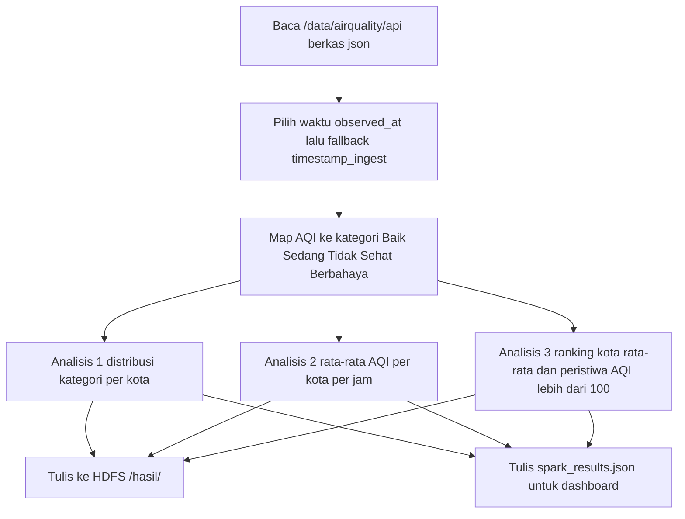

---

### 12. Flask dashboard: sumber data dan rute

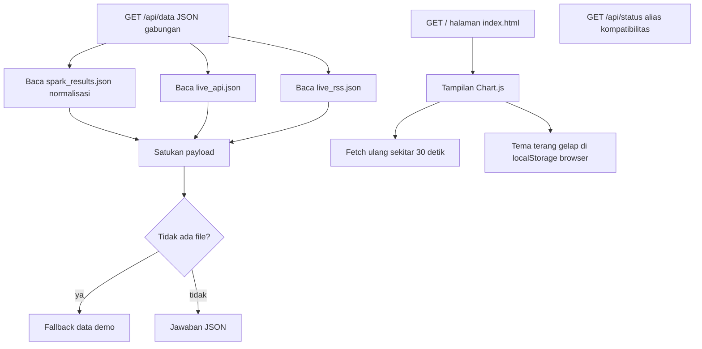

---

### 13. Urutan waktu: satu kali “gelombang” data dari sumber sampai layar

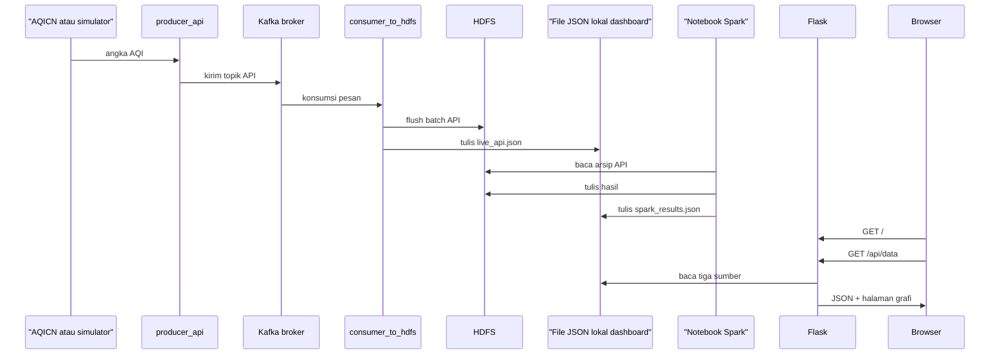

*(Pengirim RSS mengikuti jalur paralel yang sama ke topik lain.)*

---

### 14. Menyalakan proyek: urutan operasional (bukan perintah)

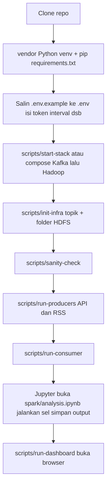

---

### 15. Peta berkas penting di repositori

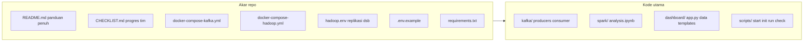

---

## Cerita naratif singkat (mengikut nomor diagram)

1. **Luar** memberi angka AQI dan berita **RSS**.
2. **`producer_api.py`** lima kota, polling ~15 menit; **`producer_rss.py`** feed terkonfigurasi, filter kata kunci, dedup, interval RSS dari `.env` (mis. ~720 jam).
3. **Kafka** menyimpan dua aliran di **topik terpisah** dengan **kunci** berbeda.
4. **`consumer_to_hdfs.py`** dua **utas**, dua **grup konsumen**, buffer lalu **flush** ke **NDJSON** di HDFS dan ke **`live_*.json`**.
5. **`spark/analysis.ipynb`** membaca arsip API, menghasilkan **tiga analisis** dan menulis **HDFS hasil** + **`spark_results.json`**.
6. **`dashboard/app.py`** menyajikan **`/`** dan **`/api/data`** menggabungkan Spark + live; **Chart.js** dan **muat ulang ~30 dtk**; **fallback** bila file belum ada.

---

## Folder penting (tabel ringkas)

| Path | Fungsi awam |
| --- | --- |
| `README.md` | Panduan penuh |
| `CHECKLIST.md` | Progres tugas |
| `docker-compose-kafka.yml` | Kafka + Zookeeper |
| `docker-compose-hadoop.yml` | HDFS + YARN |
| `hadoop.env` | Setelan Hadoop termasuk replikasi |
| `kafka/` | Pengirim dan penerima |
| `spark/` | Notebook hitung |
| `dashboard/` | Web |
| `scripts/` | Menyalakan dan menjalankan |
| `.env` | Pengaturan runtime (dari `.env.example`) |

---

## Kesimpulan

**AirQuality Alert** adalah rantai: **ambil** → **antrikan (Kafka)** → **arsipkan (HDFS)** → **cerminkan ke file dashboard** → **hitung (Spark)** → **tampilkan (Flask + browser)**. Diagram di atas sengaja **bertingkat** supaya tidak ada langkah kecil yang hilang: dari container, init topik, perilaku tiap pengirim, buffer penerima, path simpan, hingga rute web.

Jika salah satu diagram tidak tampil di penampil Markdown Anda, kemungkinan versi Mermaid lama — buka di GitHub atau VS Code dengan ekstensi Mermaid, atau laporkan blok yang error agar disederhanakan.
